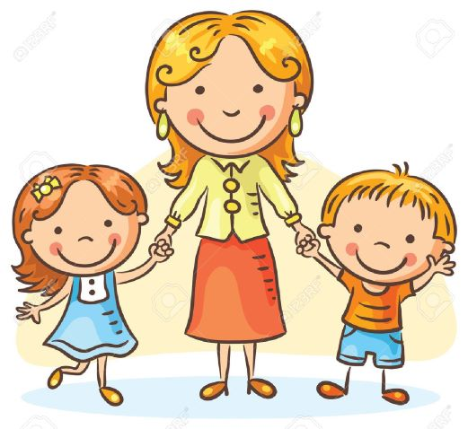

#### This report is a guidebook with selected Q&A aims at finding out the best way to make your mother happy.

 
#### The whole dataset: HappyDB is a corpus of 100,000 crowd-sourced happy moments via Amazon's Mechanical Turk. You can read more about it on https://arxiv.org/abs/1801.07746. But we only use a subset of this dataset to conduct data analysis in this report.
  
  
```{r, warning=FALSE, message=FALSE,echo=FALSE}
knitr::opts_chunk$set(echo = TRUE)
```


```{r,warning=FALSE, message=FALSE,echo=FALSE}
library(tm)
library(tidytext)
library(tidyverse)
library(DT)
library(wordcloud)
```


```{r read data, warning=FALSE, message=FALSE,echo=FALSE}
urlfile<-'https://raw.githubusercontent.com/rit-public/HappyDB/master/happydb/data/cleaned_hm.csv'
hm_data <- read_csv(urlfile)
```


```{r text processing in tm,warning=FALSE, message=FALSE,echo=FALSE}
corpus <- VCorpus(VectorSource(hm_data$cleaned_hm))%>%
  tm_map(content_transformer(tolower))%>%
  tm_map(removePunctuation)%>%
  tm_map(removeNumbers)%>%
  tm_map(removeWords, character(0))%>%
  tm_map(stripWhitespace)
```


```{r stemming,warning=FALSE, message=FALSE,echo=FALSE}
stemmed <- tm_map(corpus, stemDocument) %>%
  tidy() %>%
  select(text)
```


```{r tidy dictionary,warning=FALSE, message=FALSE,echo=FALSE}
dict <- tidy(corpus) %>%
  select(text) %>%
  unnest_tokens(dictionary, text)
```


```{r stopwords,warning=FALSE, message=FALSE,echo=FALSE}
data("stop_words")

word <- c("happy","ago","yesterday","lot","today","months","month",
                 "happier","happiest","last","week","past")

stop_words <- stop_words %>%
  bind_rows(mutate(tibble(word), lexicon = "updated"))
```


```{r tidy stems with dictionary,warning=FALSE, message=FALSE,echo=FALSE}
completed <- stemmed %>%
  mutate(id = row_number()) %>%
  unnest_tokens(stems, text) %>%
  bind_cols(dict) %>%
  anti_join(stop_words, by = c("dictionary" = "word"))
```

```{r stem completion, warning=FALSE, message=FALSE,echo=FALSE}
completed <- completed %>%
  group_by(stems) %>%
  count(dictionary) %>%
  mutate(word = dictionary[which.max(n)]) %>%
  ungroup() %>%
  select(stems, word) %>%
  distinct() %>%
  right_join(completed) %>%
  select(-stems)
```


```{r reverse unnest,warning=FALSE, message=FALSE,echo=FALSE}
completed <- completed %>%
  group_by(id) %>%
  summarise(text = str_c(word, collapse = " ")) %>%
  ungroup()
```


```{r cleaned hm_data, warning=FALSE, message=FALSE,echo=FALSE}
hm_data <- hm_data %>%
  mutate(id = row_number()) %>%
  inner_join(completed)
```

```{r export data,echo=FALSE}
write_csv(hm_data, "../output/processed_moments.csv")  

```

```{r, warning=FALSE, message=FALSE,echo=FALSE}
library(tidyverse)
library(tidytext)
library(DT)
library(scales)
library(wordcloud2)
library(gridExtra)
library(ngram)
library(igraph)
library(ggraph)
library(rsconnect)
```


```{r, message=FALSE,echo=FALSE}
# Step 1 - Load the processed text data along with demographic information on contributors

# We use the processed data for our analysis and combine it with the demographic information available.
hm_data <- read_csv("../output/processed_moments.csv")

urlfile<-'https://raw.githubusercontent.com/rit-public/HappyDB/master/happydb/data/demographic.csv'
demo_data <- read_csv(urlfile)
```


```{r combining data, message=FALSE,echo=FALSE}
# Combine both the data sets and keep the required columns for analysis

# We select a subset of the data that satisfies specific row conditions.
hm_data <- hm_data %>%
  inner_join(demo_data, by = "wid") %>%
  select(wid,
         original_hm,
         gender, 
         marital, 
         parenthood,
         reflection_period,
         age, 
         country, 
         ground_truth_category, 
         predicted_category,
         text) %>%
  mutate(count = sapply(hm_data$text, wordcount)) %>%
  filter(gender %in% c("m", "f")) %>%
  filter(marital %in% c("single", "married","divorced","separated","widowed")) %>%
  filter(parenthood %in% c("n", "y")) %>%
  filter(reflection_period %in% c("24h", "3m")) %>%
  mutate(reflection_period = fct_recode(reflection_period, 
                                        months_3 = "3m", hours_24 = "24h"))
```


## Question 1: Do mothers really regret giving birth to their kids? What about fathers?

For me,to make my mother happy is a great challenge. I alwyas make my mother angry. (Instead, it seems that my father will never be mad at me)
Sometimes my mother even say "I would rather not to give birth to you". I feel really sad after she said this to me.(Of course, my father never said this to me.) And this is a common sitaution among my friends. So my first question is: Do mothers really regret giving birth to their kids? What about fathers?

I try to answer this question by comparing the "happy moments" among females/males before becoming fathers/mothers and after becoming fathers/mothers. I hope to see if their happy moments change and if they can gain much happiness from kids.

I define mothers/fathers as females/males with parenthood while regardless of their martial status.

```{r,echo=FALSE}
hm_data_mother <- hm_data[hm_data$gender=="f" & hm_data$parenthood=="y",]
hm_data_notmother <- hm_data[hm_data$gender=="f" & hm_data$parenthood=="n",]
hm_data_female <- hm_data[hm_data$gender=="f",]
```

```{r,echo=FALSE}
bag_of_words_female <-  hm_data_female %>%
  unnest_tokens(word, text)

word_count_female <- bag_of_words_female %>%
  count(word, sort = TRUE)
```

```{r,warning=FALSE, message=FALSE,echo=FALSE}
temp <- bag_of_words_female %>%
      count(parenthood, word) %>%
      group_by(parenthood) %>%
      mutate(proportion = n / sum(n)) %>% 
      select(-n) %>% 
      spread(parenthood, proportion)
ggplot(temp, 
             aes_string(x = colnames(temp)[2], y = colnames(temp)[3]),
             color = abs(colnames(temp)[3] - colnames(temp)[2])) +
      geom_abline(color = "gray40", lty = 2) +
      geom_jitter(alpha = 0.1, size = 1, width = 0.3, height = 0.3) +
  labs(title="Words Proportion for females with/without parenthood")+
      geom_text(aes(label = word), check_overlap = TRUE, vjust = 1.5) +
      scale_x_log10(labels = percent_format()) +
      scale_y_log10(labels = percent_format()) +
      scale_color_gradient(limits = c(0, 0.001), low = "darkslategray4", high = "gray75") +
      theme(legend.position="none")
  
```


```{r, warning=FALSE, message=FALSE,echo=FALSE}
hm_data_father <- hm_data[hm_data$gender=="m" & hm_data$parenthood=="y",]
hm_data_notfather <- hm_data[hm_data$gender=="m" & hm_data$parenthood=="n",]
hm_data_male <- hm_data[hm_data$gender=="m",]
#table(hm_data_notmother$age)
#table(hm_data_mother$age)
```


```{r, warning=FALSE, message=FALSE,echo=FALSE}
bag_of_words_male <-  hm_data_male %>%
  unnest_tokens(word, text)

word_count_male <- bag_of_words_male %>%
  count(word, sort = TRUE)
```


```{r, warning=FALSE, message=FALSE,echo=FALSE}
temp <- bag_of_words_male %>%
      count(parenthood, word) %>%
      group_by(parenthood) %>%
      mutate(proportion = n / sum(n)) %>% 
      select(-n) %>% 
      spread(parenthood, proportion)
ggplot(temp, 
             aes_string(x = colnames(temp)[2], y = colnames(temp)[3]),
             color = abs(colnames(temp)[3] - colnames(temp)[2])) +
      geom_abline(color = "gray40", lty = 2) +
      geom_jitter(alpha = 0.1, size = 1, width = 0.3, height = 0.3) +
      geom_text(aes(label = word), check_overlap = TRUE, vjust = 1.5) +
      labs(title="Words Proportion for males with/without parenthood")+
      scale_x_log10(labels = percent_format()) +
      scale_y_log10(labels = percent_format()) +
      scale_color_gradient(limits = c(0, 0.001), low = "darkslategray4", high = "gray75") +
      theme(legend.position="none")
  
```

According to the two plots above, regardless of the parenthood, females/males will always mention the words "day","family","birthday" in their "happy moments". But for females/males with parenthood, the propotion of words related to their children such as "daughter","son","kids" are extremely high. 
After females/males become mothers/fathers, many more happy moments are related to their kids.

Also, we could see the similar results from the separate word clouds.

```{r, message=FALSE,echo=FALSE}
bag_of_words_mother <-  hm_data_mother %>%
  unnest_tokens(word, text)

word_count_mother <- bag_of_words_mother %>%
  count(word, sort = TRUE)

bag_of_words_notmother <-  hm_data_notmother %>%
  unnest_tokens(word, text)

word_count_notmother <- bag_of_words_notmother %>%
  count(word, sort = TRUE)

# ignore the two useless words: time and day

word_count_mother <-word_count_mother[-c(which(word_count_mother$word=="day"),which(word_count_mother$word=="time")),]

word_count_notmother <-word_count_notmother[-c(which(word_count_notmother$word=="day"),which(word_count_notmother$word=="time")),]
```

```{r,message=FALSE,warning=FALSE,echo=FALSE}
wordcloud(word_count_mother$word,word_count_mother$n ,
          scale=c(3,0.1),
          max.words=100,
          min.freq=1,
          random.order=FALSE,
          rot.per=0.3,
          use.r.layout=T,
          random.color=FALSE,
          colors=brewer.pal(9,"Oranges"))

```

```{r, warning=FALSE,message=FALSE,echo=FALSE}
wordcloud(word_count_notmother$word,word_count_notmother$n ,
          scale=c(3,0.1),
          max.words=100,
          min.freq=1,
          random.order=FALSE,
          rot.per=0.3,
          use.r.layout=T,
          random.color=FALSE,
          colors=brewer.pal(9,"Oranges"))

```

Ignore the two most frequent but "useless" words "time" and "day", the two words clouds show that females with parenthood mention "daughter","son","husbund" and "friend" a lot while females without parenthood only mention "friend" most in their happy moments.


```{r, warning=FALSE, message=FALSE,echo=FALSE}
bag_of_words_father <-  hm_data_father %>%
  unnest_tokens(word, text)

word_count_father <- bag_of_words_father %>%
  count(word, sort = TRUE)

bag_of_words_notfather <-  hm_data_notfather %>%
  unnest_tokens(word, text)

word_count_notfather <- bag_of_words_notfather %>%
  count(word, sort = TRUE)

# ignore the two useless words: time and day

word_count_father <-word_count_father[-c(which(word_count_father$word=="day"),which(word_count_father$word=="time")),]

word_count_notfather <-word_count_notfather[-c(which(word_count_notfather$word=="day"),which(word_count_notfather$word=="time")),]

```

```{r, warning=FALSE, message=FALSE,echo=FALSE}
wordcloud(word_count_father$word,word_count_father$n ,
          scale=c(3,0.1),
          max.words=100,
          min.freq=1,
          random.order=FALSE,
          rot.per=0.3,
          use.r.layout=T,
          random.color=FALSE,
          colors=brewer.pal(9,"Blues"))
```

```{r, warning=FALSE, message=FALSE,echo=FALSE}
wordcloud(word_count_notfather$word,word_count_notfather$n ,
          scale=c(3,0.1),
          max.words=100,
          min.freq=1,
          random.order=FALSE,
          rot.per=0.3,
          use.r.layout=T,
          random.color=FALSE,
          colors=brewer.pal(9,"Blues"))
```

Similarly, the two words clouds above show that males with parenthood mention "daughter","son","wife" and "friend" a lot while males without parenthood mention "friend" most in their happy moments.

But if we look at the words clouds for females/males with parenthood carefully, we can find out an interesting phenomenon that it seems mothers mention their kids more than their husbands and friends while fathers still mention friends more than their kids.

This result can be shown more obviously by the words frequency bar charts below.


```{r,warning=FALSE, message=FALSE,echo=FALSE}
 word_count_mother[1:15,] %>%
      mutate(word = reorder(word, n)) %>%
      ggplot(aes(word, n)) +
      geom_col() +
      labs(title = "Word Frequency in Happy Moments for mothers")+
      xlab(NULL) +
      ylab("Word Frequency")+
      coord_flip()
``` 
```{r,warning=FALSE, message=FALSE,echo=FALSE}
 word_count_father[1:15,] %>%
      mutate(word = reorder(word, n)) %>%
      ggplot(aes(word, n)) +
      geom_col() +
      labs(title ="Word Frequency in Happy Moments for fathers")+
      xlab(NULL) +
      ylab("Word Frequency")+
      coord_flip()
``` 
 
 
We can see the top two frequent words mentioned by mothers are "son" and "daughter". After that, mothers will mention "husband" and then "friends".

However, fathers mention "wife" and "friend" more frequently than "son" and "daughter" in their happy moments.
 
#### Both mothers and fathers gain lots of happiness from their kids, so I don't think they regret giving birth to their kids. What is more, mothers mention "son" and "daughter" most frequently. So I think, mothers really enjoy having kids.

So when mothers said "I would rather not to give birth to you", that means they are very angry. They don't really feel regret for they always think about their kids when asked about the happy moments. 

Mothers really love us, but why do they always be mad at us?

I tried my best to make my mother happy but always in vain. What should I do? 

Also,when I check the post on social media like Weibo or Youtube, I can always find out many hot videos including "how my mother is angry when I spend summer holiday at home","why my mother is so unhappy during Spring Festival". It looks like lots of kids face the same problem with me. So what should we do?
 
 
## Question 2: How to make mothers happy?

I try to solve this question by looking at all the happy moments including words like "child","baby","daughter" and "son" mentioned by mothers and find some patterns in the data.

```{r,warning=FALSE, message=FALSE,echo=FALSE}
hm_data_motherchild <- hm_data_mother[grepl("baby",hm_data_mother$text)|grepl("child",hm_data_mother$text)|grepl("son",hm_data_mother$text)|grepl("daughter",hm_data_mother$text)|grepl("kid",hm_data_mother$text),]
nrow(hm_data_motherchild)
```
Among the 20722 happy moments created by mothers, 6257 happy moments are related to their kids.So, I try to find out the most frequent words in this subset of data. Similarly, I ignore the two words "day","time" and the words used to choose subset such as "child","daughter" and "son" and only count the frequency of the rest words.


```{r,warning=FALSE, message=FALSE,echo=FALSE}

bag_of_words_motherchild <-  hm_data_motherchild %>%
  unnest_tokens(word, text)

word_count_motherchild <- bag_of_words_motherchild %>%
  count(word, sort = TRUE)

word_count_motherchild<- word_count_motherchild[-c(which(word_count_motherchild$word=="day"),which(word_count_motherchild$word=="time"),which(word_count_motherchild$word=="baby"),which(word_count_motherchild$word=="child"),which(word_count_motherchild$word=="son"),which(word_count_motherchild$word=="daughter"),which(word_count_motherchild$word=="kid"),which(word_count_motherchild$word=="kids"),which(word_count_motherchild$word=="children")),]

word_count_motherchild[1:20,] %>%
      mutate(word = reorder(word, n)) %>%
      ggplot(aes(word, n)) +
      geom_col() +
      xlab(NULL) +
      ylab("Word Frequency")+
      coord_flip()
wordcloud(word_count_motherchild$word,word_count_motherchild$n ,
          scale=c(3,0.1),
          max.words=100,
          min.freq=1,
          random.order=FALSE,
          rot.per=0.3,
          use.r.layout=T,
          random.color=FALSE,
          colors=brewer.pal(9,"Accent"))
```

From the word frequency bar chart and words clouds above, we can see happy moments related to kids includes "school" most frequently. 

#### That means, in order to make mothers happy, performing well at school is most useful. 

Below are some examples of the happy moments related to kids and "school" created by mothers. We can see mothers feel happy when we have good grades, behave well in activities or receive an award. 

```{r,warning=FALSE, message=FALSE,echo=FALSE}
hm_data_motherchild[grepl("school",hm_data_motherchild$text),"original_hm"][c(1,2,7,10,11,21),]

```

In fact, from the words frequency in happy moments created by mothers, we could see the word "husband" is mentioned only second to "son" and "daughter". So after we perform well in school, maybe we can also ask our fathers to do something in order to let mothers happy.
 
## Question 3: Dad, do you know how you can make mother happier?

We consider the subset which includes the word "husband" and find out there are 1760 happy moments related to "husband". Altough the number is much smaller than the number of happy moments related to kids, "husband" still plays an important role in mothers' happy moments.
```{r,warning=FALSE, message=FALSE,echo=FALSE}
hm_data_motherhusband <- hm_data_mother[grepl("husband",hm_data_mother$text),]
nrow(hm_data_motherhusband)

```

```{r,warning=FALSE, message=FALSE,echo=FALSE}

bag_of_words_motherhusband <-  hm_data_motherhusband %>%
  unnest_tokens(word, text)

word_count_motherhusband <- bag_of_words_motherhusband %>%
  count(word, sort = TRUE)

word_count_motherhusband<- word_count_motherhusband[-c(which(word_count_motherhusband$word=="day"),which(word_count_motherhusband$word=="time"),which(word_count_motherhusband$word=="husband")),]

word_count_motherhusband[1:20,] %>%
      mutate(word = reorder(word, n)) %>%
      ggplot(aes(word, n)) +
      geom_col() +
      xlab(NULL) +
      ylab("Word Frequency")+
      coord_flip()
wordcloud(word_count_motherhusband$word,word_count_motherhusband$n ,
          scale=c(4,0.5),
          max.words=100,
          min.freq=1,
          random.order=FALSE,
          rot.per=0.3,
          use.r.layout=T,
          random.color=FALSE,
          colors=brewer.pal(9,"Accent"))
```

From the word frequency bar chart and words clouds above, we can see the top 3 frequent words in happy moments related to "husband" are "home","dinner" and "surprise".

#### That means, we should ask our fathers to spend more time at home, to cook dinner and to prepare surprise for mothers.

Below are some examples of the happy moments related to "husband", "home","dinner" and "surprise" created by mothers. 

```{r,warning=FALSE, message=FALSE,echo=FALSE}
hm_data_motherhusband[grepl("home",hm_data_motherhusband$text),"original_hm"][c(2,3),]
hm_data_motherhusband[grepl("dinner",hm_data_motherhusband$text),"original_hm"][c(1,2),]
hm_data_motherhusband[grepl("surprise",hm_data_motherhusband$text),"original_hm"][c(2,3),]
```
 
 

## Conclusions
1. Mothers and fathers really gain happiness from their kids. Mothers mention kids most frequently when recall their happy moments.(Fathers also gain happiness from kids, however, they still put "wife" and "friend" in the first place)

2. Performing well in school makes mother happy.

3. Ask father to spend time at home, make dinner and prepare surprise can also make mother happy.


 
